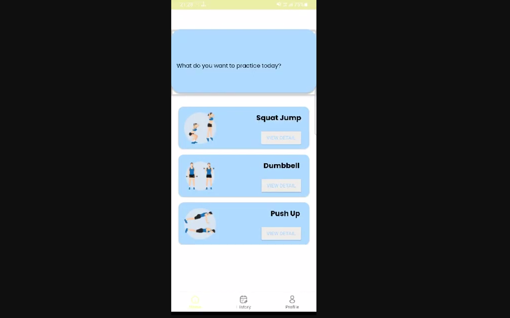

# FitAssistAI-bangkit-capstone-2023

### About Project
Our project aims to address the challenges of poor form and inefficient workouts, which can lead to injuries, slower progress, and reduced motivation. There have been previous attempts to address the challenges of poor form and inefficient workouts through various fitness apps and devices. Some existing solutions may offer video tutorials or pre-recorded instructions, while others use sensors or motion tracking technology to provide feedback on form. However, FitAssistAI aims to differentiate itself by leveraging AI technology to analyze user form in real-time and provide personalized feedback and recommendations. The combination of AI-driven analysis, real-time feedback, and adaptability to individual user needs sets FitAssistAI apart from existing solutions in the market.

  <h3>Our Team</h3>
  <h3>Team ID: C23-PS392</h3>
  <table align="center">
    <tr>
      <th>Bangkit ID</th>
      <th>Name</th>
      <th>Learning Path</th>
      <th>Profile</th>
    </tr>
    <tr>
      <td>M166DKX3755</td>
      <td>Andromedha Anjar Wasari</td>
      <td>Machine Learning</td>
      <td>
        
        
      </td>
    </tr>
    <tr>
      <td>M166DKX3760</td>
      <td>Husain Abidin Widayat</td>
      <td>Machine Learning</td>
    <td>
        
        
      </td>
    </tr>
    <tr>
      <td>C286DSX3672 </td>
      <td>Hendra Haksana Putra</td>
      <td>Cloud Computing</td>
    <td>
        
        
      </td>
    </tr>
    <tr>
      <td>C005DKX3831 </td>
      <td>Muhammad Nabawi</td>
      <td>Cloud Computing</td>
 <td>
        
        
      </td>
    </tr>
    <tr>
      <td>A042DSY3700 </td>
      <td>Bella Indryanti</td>
      <td>Mobile Development</td>
   <td>
        
        
      </td>
    </tr>
    <tr>
      <td>A042DSX3595 </td>
      <td>Muhammad Naufal Rafi Taqiyuddin</td>
      <td>Mobile Development</td>
 <td>
        
        
      </td>
    </tr>
  </table>

### Demo Our App

  

